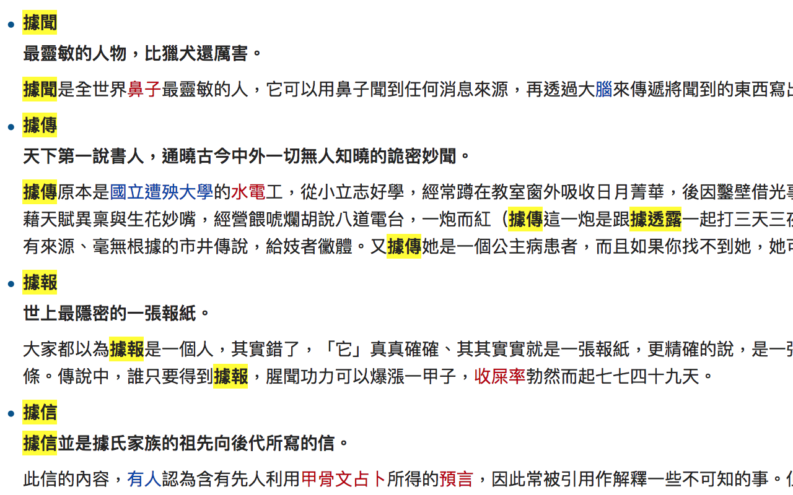

# doubtedNewsSource

可疑新聞偵測器

看新聞還要花心力注意消息來源很累，所以寫了這個小工具標示出常見的豪洨用詞。

例如【據了解】【據傳】【消息指出】。接下來的新聞可信度請自行判斷。

chrome 套件下載處：
https://chrome.google.com/webstore/detail/odeilkajklkkkpinpbahehibpobhfjim

---

